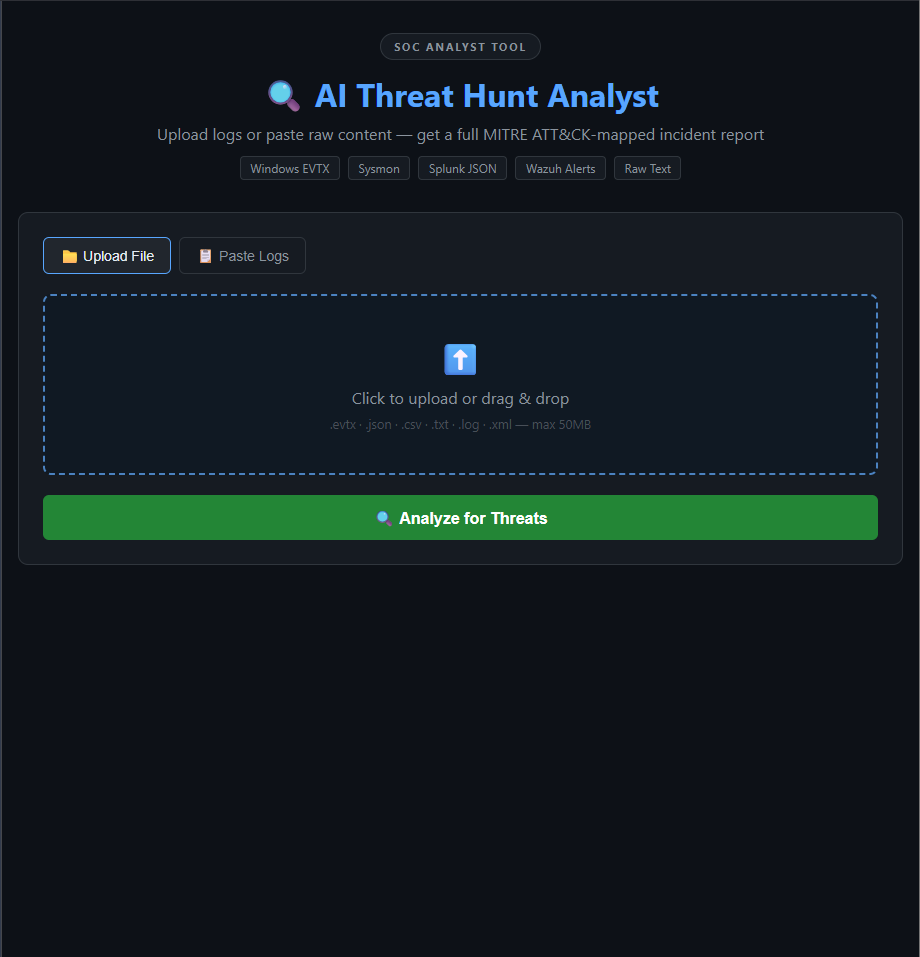
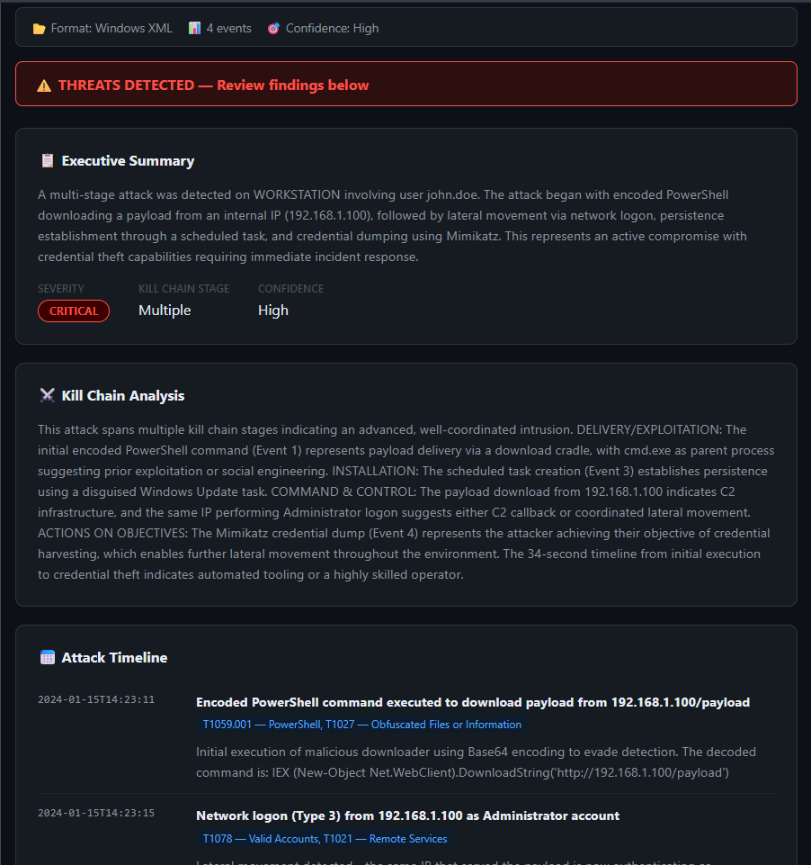
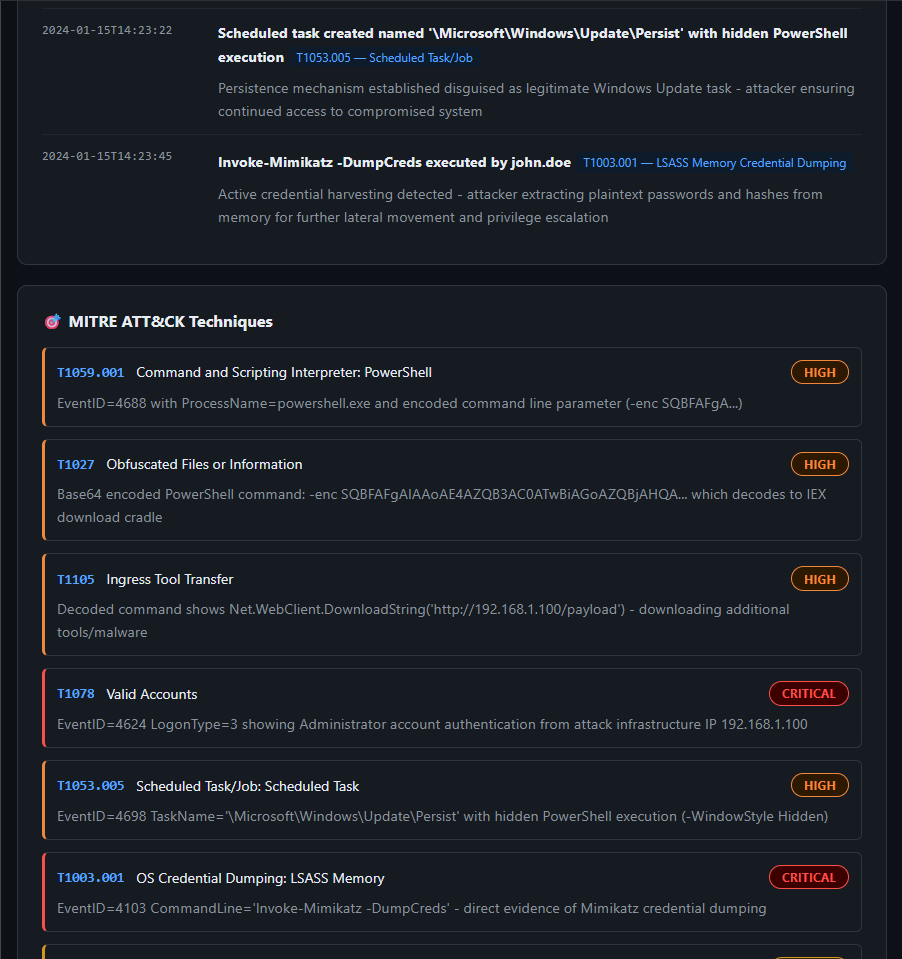
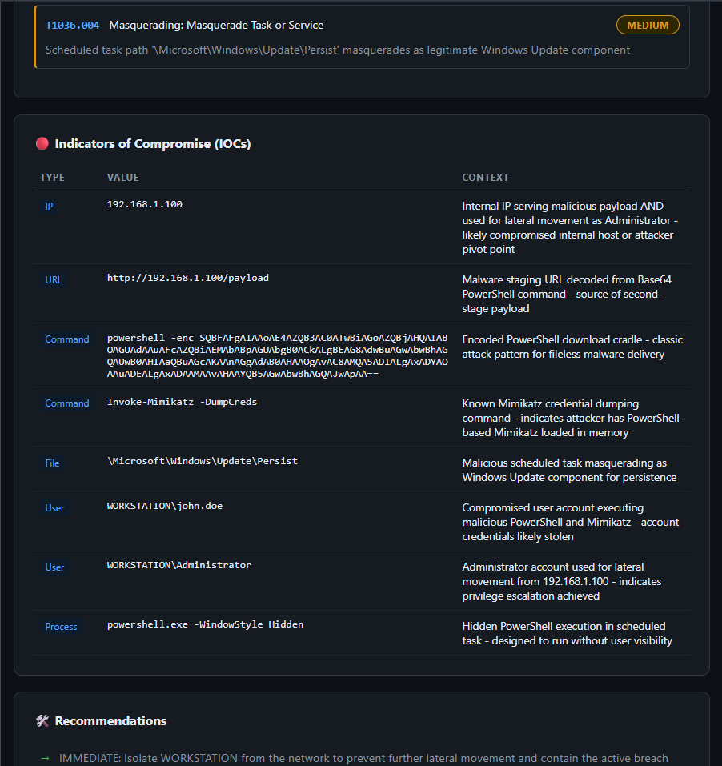
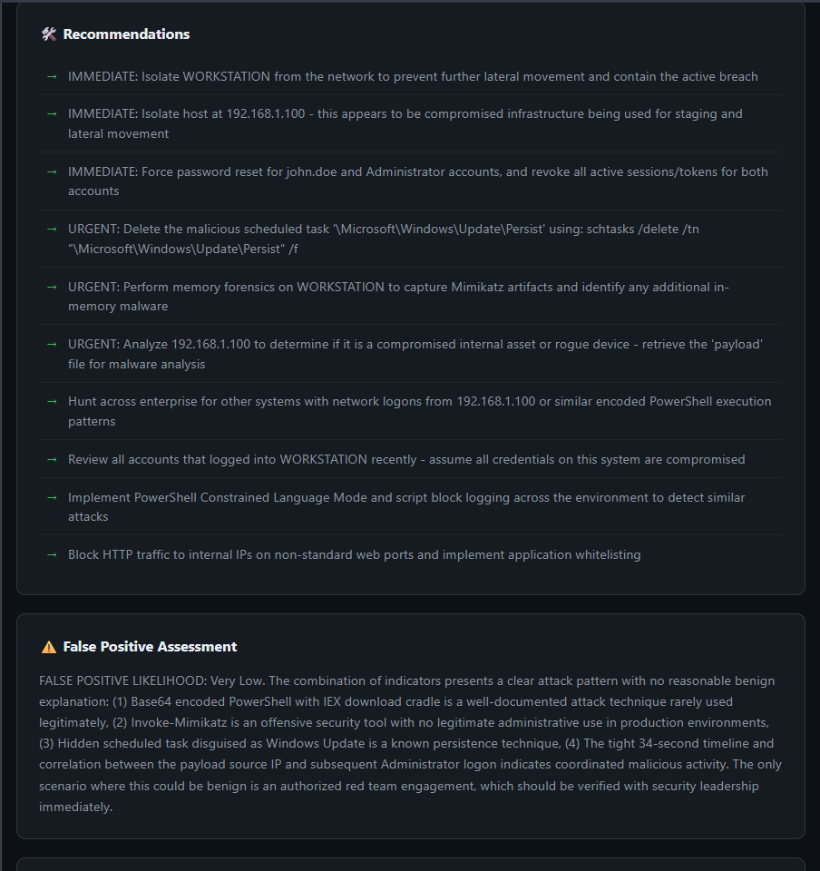

# AI Threat Hunt Analyst

AI-powered threat hunting web application that analyzes Windows EVTX, Sysmon, Splunk, Wazuh, and raw log files to generate full MITRE ATT&CK-mapped SOC incident reports — featuring attack timelines, kill chain analysis, IOC extraction, and remediation guidance — built with Python, Flask, and the Anthropic Claude API.

## Features
- Drag-and-drop file upload or raw log paste
- Auto-detects log format (EVTX, JSON, CSV, XML, raw text)
- MITRE ATT&CK technique mapping with evidence
- Full attack timeline with timestamps
- Kill chain stage analysis
- IOC extraction table (IPs, domains, commands, users, files)
- Actionable remediation steps
- False positive assessment
- Analyst notes with decoded payloads

## Supported Log Sources
- Windows EVTX / Sysmon
- Splunk JSON exports
- Wazuh alerts
- Raw text / paste any log format

## Tech Stack
Python · Flask · Anthropic Claude API · HTML/CSS/JS · python-evtx

## Setup
1. Clone the repo
2. `python -m venv venv && venv\Scripts\activate`
3. `pip install -r requirements.txt`
4. Create `.env` with `ANTHROPIC_API_KEY=your_key`
5. `python app.py`
6. Open `http://127.0.0.1:5000`

## Screenshots

### UI — Upload or Paste Logs

### Threat Detected Banner + Executive Summary

### Attack Timeline

### MITRE ATT&CK Techniques

### IOC Table

### Recommendations + False Positive Assessment

## Development Challenges & How I Solved Them

### 1. API Key Committed to Git — Again
Despite learning this lesson on Project 1, the `.env` file was committed again on the initial commit before the `.gitignore` was applied. GitHub's push protection blocked the push with a GH013 secret scanning violation. Applied the same fix as Project 1 — used `git filter-repo` to scrub the key from commit history, re-added the remote, and force-pushed the clean history. Lesson reinforced: always verify `.gitignore` is saved and applied before the first `git add .`

### 2. venv Folder Pushed Again
The `venv/` directory was included in the initial commit because git was initialized before `.gitignore` was in place. Removed it from tracking with `git rm -r --cached venv`, committed, and pushed. Added `venv/` to `.gitignore` before any future commits.

### 3. Multi-Format Log Parsing
Handling four different log formats (EVTX binary, JSON, CSV, raw text) in a single parser required format auto-detection logic. Built a `detect_format()` function in `log_parser.py` that inspects both the filename extension and content heuristics — checking for XML tags, Splunk-specific fields, and Wazuh-specific fields — to route each file to the correct parser before sending to Claude.

### 4. EVTX Binary Parsing on Windows
The `python-evtx` library requires the file to be accessible on disk — it cannot parse a file stream directly. Solved by saving uploaded files to a temporary `uploads/` directory first, parsing from disk, then deleting the file immediately after analysis in a `finally` block to ensure cleanup even if parsing fails.

### 5. Claude API Response Size Management
Sending large log files to Claude risked exceeding the context window. Implemented a hard cap of 200 events per parse and a 30,000 character truncation limit on the serialized JSON before sending to the API — ensuring the app handles large files gracefully without crashing.

### 6. Drag and Drop File Upload
Implementing drag-and-drop required handling both the `dragover`, `dragleave`, and `drop` browser events manually in JavaScript, plus preventing default browser behavior (which would navigate away from the page). Added visual feedback by toggling CSS classes on the dropzone during drag events so users get clear confirmation their file was received.
